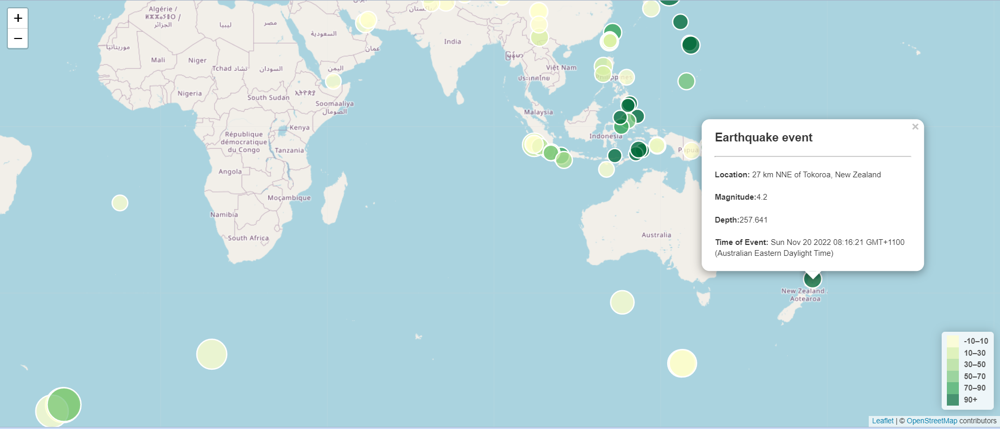

<!-- PROJECT LOGO -->
 

  

<h3 align="center">Leaflet-challenge</h3>

  

     
    <a href="https://github.com/joshmartin33/leaflet-challenge.git" target="_blank"><strong>Explore the docs »</strong></a>
     
     
    <a href="https://joshmartin33.github.io/leaflet-challenge/" target="_blank">View Github pages</a>
    ·
    <a href="https://github.com/joshmartin33/leaflet-challenge/issues">Report Bug</a>
  

<!-- TABLE OF CONTENTS -->

  
Table of Contents

  <ol>
    <li><a href="#about-the-project">About The Project</a></li>
    <li><a href="#setup">Setup</a></li>
    <li><a href="#outcomes">Outcomes</a></li>
        <ul style="list-style-type:square;">
            <li><a href="#earthquake-visualisation">Earthquake Visualisation</a></li>
        </ul>
    <li><a href="#creators">Creators</a></li>
    <li><a href="#citing-and-referencing">Citing and Referencing</a></li>
  </ol>

<!-- ABOUT THE PROJECT -->
## About The Project

The United States Geological Survey, or USGS for short, is responsible for providing scientific data about natural hazards, the health of our ecosystems and environment, and the impacts of climate and land-use change. Their scientists develop new methods and tools to supply timely, relevant, and useful information about the Earth and its processes.

The USGS is interested in building a new set of tools that will allow them to visualise their earthquake data. They collect a massive amount of data from all over the world each day, but they lack a meaningful way of displaying it. In this challenge, I have been tasked with developing a way to visualise USGS data that will allow them to better educate the public and other government organisations (and hopefully secure more funding) on issues facing our planet.

(<a href="#readme-top">back to top</a>)

<!-- setup -->
## Setup
 
To get a your own copy up and running follow these example steps.
  
<ul>

<li> Download GitHub repository files</li>
<a href= "https://github.com/joshmartin33/leaflet-challenge/archive/refs/heads/main.zip">Download Zip files</a>

<li>Create a new repository.</li>
<li>Clone the new repository to your computer.</li>
<li>Inside your local git repository, copy the files from in the GitHub downloaded files.</li>
<li>Push the above changes to GitHub.</li>
<li>Deploy the new repository to GitHub Pages.</li>
</ul>

(<a href="#readme-top">back to top</a>)

<!-- outcomes -->
## Outcomes
 

<!-- Earthquake Visualisation -->
### Earthquake Visualisation
 
Map chart to display the Earthquake data, using Leaflet, that plots all the earthquakes from our dataset based on their longitude and latitude.
 
 
The visualisation includes:
<ul> 
    <li>Data markers which reflect the magnitude of the earthquake by their size and the depth of the earthquake by colour. Earthquakes with higher magnitudes appear larger, and earthquakes with greater depth appear darker in colour.</li>
    <li>Popups that provide additional information about the earthquake when its associated marker is clicked.</li>
</ul>
 

 

(<a href="#readme-top">back to top</a>)

<!-- Creators -->
## Creators

Josh Martin - <a href="https://github.com/joshmartin33">GitHub</a>

(<a href="#readme-top">back to top</a>)

<!-- Citing and Referencing -->
## Citing and Referencing

* Dataset created by: <a href="https://earthquake.usgs.gov/earthquakes/feed/v1.0/summary/all_week.geojson">the United States Geological Survey</a>

(<a href="#readme-top">back to top</a>)
